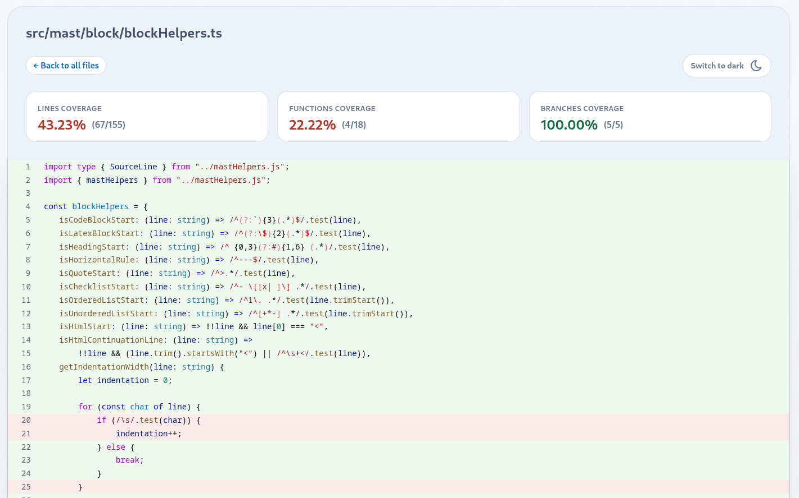
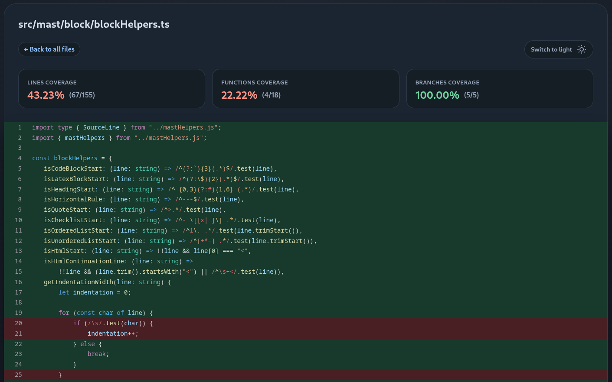
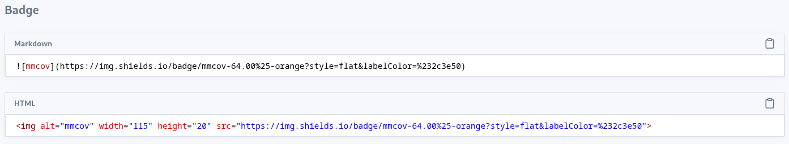
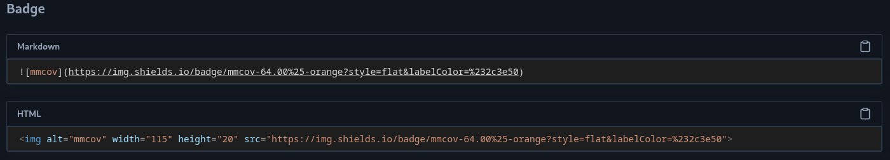

<!-- markdownlint-disable MD033 -->
#  mmcov

`mmcov` is a Node.js library that converts an `lcov.info` file into a static HTML coverage site.

It generates:

- an `index.html` summary page
- one HTML page per covered source file
- an overall coverage badge with Markdown and HTML copy snippets

## Installation

`mmcov` is published as a package with ESM and CommonJS exports.

```sh
# npm
npm install --save-dev mmcov

# pnpm
pnpm add -D mmcov
```

## Usage

### Programmatic

Import `generateLcovReport` and call it with an options object.

```js
import { generateLcovReport } from "mmcov";

await generateLcovReport({
  lcovPath: "coverage/lcov.info",
  sourceDirs: ["lib", "src"],
  destDir: "docs/coverage",
  projectTitle: "My Project",
  favicon: "public/favicon.ico",
});
```

### CLI

`mmcov` also ships a command-line interface.

```sh
# Show help
mmcov --help

# Run using options from mmcov.config.{ts,js,mjs}
mmcov

# Create a starter mmcov config file
mmcov init

# Generate from a positional lcov file argument
mmcov coverage/lcov.info

# Generate with explicit options
mmcov --entry coverage/lcov.info --out coverage --source src,lib --project my-project --mmdocs
```
<!-- markdownlint-disable MD036 -->
**CLI options**

| Flag | Description |
| --- | --- |
| `init` | Generate a starter config file |
| `<entry>` | Path to the lcov file (positional, optional when `--entry` is used) |
| `--entry <path>` | Path to the lcov file |
| `--out <path>` | Output directory (maps to `destDir`) |
| `--source <dirs>` | Comma-separated source directories to include (maps to `sourceDirs`) |
| `--favicon <path>` | Path to a custom favicon file |
| `--project <name>` | Project name; hyphens are replaced with spaces |
| `--mmdocs` | Enable MMDOCS-compatible link generation |
| `--help` | Print help text |

## API

### `generateLcovReport(options)`

Parses the LCOV file, loads matching source files from the current working directory, applies Shiki syntax highlighting, and writes minified HTML output.

## Options

| Option | Type | Required | Description |
| --- | --- | --- | --- |
| `lcovPath` | `string` | Yes | Path to the `lcov.info` file, resolved from `process.cwd()` |
| `sourceDirs` | `string[]` | No | Source directory prefixes to include from LCOV `SF:` entries, such as `src` or `lib` |
| `destDir` | `string` | No | Output directory for generated files. Defaults to `coverage` |
| `projectTitle` | `string` | No | Custom title used in the report header and page titles |
| `favicon` | `string` | No | Path to a custom `.ico` file. When omitted, the built-in icon is used |
| `mmdocs` | `boolean` | No | Enables MMDOCS-compatible link paths in generated pages |

## Generated output

By default, `mmcov` writes the report to `coverage`.

The generated site includes:

- total line, function, and branch coverage on the index page
- a file table with per-file coverage percentages and links
- file detail pages with syntax-highlighted source code
- highlighted missed lines in the source view
- light and dark theme switching stored in local storage
- badge snippets that can be copied as Markdown or HTML

## Supported highlighting

The built-in syntax highlighter is configured for:

- `ts`
- `js`
- `tsx`
- `jsx`
- `json`
- `cts`
- `mjs`
- `mts`

Files outside those extensions fall back to plain text highlighting.

## Notes

- If `sourceDirs` is provided, it should match the prefixes used by `SF:` records in your LCOV file.
- The input file is validated as proper LCOV format before processing; an invalid file causes the process to exit with an error message.
- Output file names for source pages are derived from the original file path and flattened into HTML files inside `destDir`.
- The report pages are static and do not require a server-side runtime.

## UI preview

### Home


### File




### Badge




## Changelog

<https://github.com/phothinmg/mmcov/blob/main/CHANGELOG.md>

## License

[Apache-2.0](LICENSE) © [Pho Thin Maung](phothinmg.github.io)
